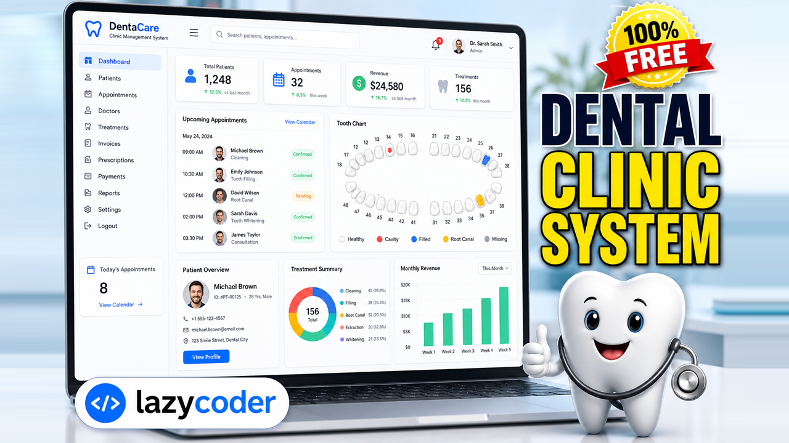

# Dental Clinic Management System



A comprehensive, production-quality **Dental Clinic Management System** built with **Django**. It digitises the complete workflow of a modern dental practice — appointments, an interactive 32‑tooth chart, treatments, digital prescriptions, invoicing & payments, inventory, reviews and rich analytics — across four uniquely themed, **role-based dashboards** (Administrator, Dentist, Receptionist, Patient).

It also ships with a suite of **offline, rule-based AI tools** (symptom checker, chatbot, cost estimator, no‑show risk) that require **no API keys** and no paid services.

> Built for the **lazycoder** YouTube channel as a full, end-to-end reference project.

---

## Table of Contents

- [Features](#features)
- [Tech Stack](#tech-stack)
- [Screenshots & Diagrams](#screenshots--diagrams)
- [Getting Started](#getting-started)
- [Demo Login Accounts](#demo-login-accounts)
- [Key URLs](#key-urls)
- [Project Structure](#project-structure)
- [Project Report](#project-report)
- [License](#license)

---

## Features

- **Role-based dashboards** — a distinct theme, layout and permission set for Admin, Dentist, Receptionist and Patient.
- **Appointment management** — booking, status tracking (Pending / Confirmed / Completed / Cancelled / No‑Show) and AI no‑show risk.
- **Interactive tooth chart** — a 32‑tooth (universal numbering) chart with six condition types per patient.
- **Clinical records** — treatments linked to patient, service, tooth and cost.
- **Digital prescriptions** — multi-item prescriptions with a printable view.
- **Billing** — invoices with line items, tax, discount, partial payments and automatic balance calculation.
- **Inventory** — stock tracking with low-stock alerts.
- **Reviews** — patient feedback shown on the public website.
- **Offline AI assistant** — symptom checker, Niru's Care chatbot and treatment cost estimator (no external APIs).
- **Analytics** — revenue, appointment and patient-growth charts powered by Chart.js.
- **Custom admin panel** — a bespoke management console (the default Django admin is intentionally not used) with full CRUD.
- **Public marketing website** — home, services (with pricing), about and contact pages.
- **Responsive & accessible** — works beautifully on desktop, tablet and mobile.
- **Privacy-safe demo data** — seeded data uses `example.com` emails and placeholder phone numbers only.

---

## Tech Stack

| Layer        | Technology                        |
| ------------ | --------------------------------- |
| Language     | Python 3.10+                      |
| Framework    | Django 5.x (Model‑View‑Template)  |
| Database     | SQLite (dev) / PostgreSQL (prod)  |
| Styling      | Bootstrap 5 + custom CSS theming  |
| Icons        | Bootstrap Icons                   |
| Charts       | Chart.js                          |
| Images       | Pillow                            |
| Fonts        | Google Fonts (Inter)             |

---

## Screenshots & Diagrams

All system diagrams (architecture, use‑case, ER, DFD levels 0 & 1, class, sequence, activity and module hierarchy) are included in [`report/diagrams/`](report/diagrams) and embedded in the full project report.

---

## Getting Started

### Prerequisites

- **Python 3.10 or newer** — check with `python --version`
- **pip** (bundled with Python)
- **Git** (to clone the repository)

### 1. Clone the repository

```bash
git clone https://github.com/sumitkumar1503/Dental-Clinic-Management-System.git
cd Dental-Clinic-Management-System
```

### 2. Create and activate a virtual environment

**Windows (PowerShell):**

```powershell
python -m venv venv
.\venv\Scripts\Activate.ps1
```

> If activation is blocked, run PowerShell once as admin: `Set-ExecutionPolicy -Scope CurrentUser RemoteSigned`

**macOS / Linux:**

```bash
python3 -m venv venv
source venv/bin/activate
```

### 3. Install dependencies

```bash
pip install -r requirements.txt
```

### 4. Apply database migrations

```bash
python manage.py migrate
```

### 5. Seed privacy-safe demo data (recommended)

This creates demo users, services, appointments, invoices and 12 months of data so the charts look great immediately.

```bash
python manage.py seed_demo
```

### 6. Run the development server

```bash
python manage.py runserver
```

### 7. Open the app

Visit **http://127.0.0.1:8000/** in your browser.

---

## Demo Login Accounts

After running `python manage.py seed_demo`, use any of the accounts below.
**All accounts share the password:** `demo1234`

| Role          | Username    | Password   |
| ------------- | ----------- | ---------- |
| Administrator | `admin`     | `demo1234` |
| Dentist       | `drsmith`   | `demo1234` |
| Receptionist  | `reception` | `demo1234` |
| Patient       | `john`      | `demo1234` |

> Demo credentials are intentionally **not** shown on the login page for a cleaner, production-like UI — use the table above.

To create your own superuser instead:

```bash
python manage.py createsuperuser
```

---

## Key URLs

| URL                                                   | Description                       |
| ----------------------------------------------------- | --------------------------------- |
| `/`                                                   | Public homepage                   |
| `/services/`, `/about/`, `/contact/`                  | Public marketing pages            |
| `/accounts/login/`, `/accounts/signup/`               | Authentication                    |
| `/accounts/go/`                                       | Role-based dashboard redirect     |
| `/app/appointments/`                                  | Appointment management            |
| `/app/patients/`                                      | Patient records & tooth chart     |
| `/app/invoices/`                                      | Billing & payments                |
| `/ai/symptom-checker/`, `/ai/cost-estimator/`, `/ai/chatbot/` | AI tools                  |
| `/manage/`                                            | Custom administration panel       |

---

## Project Structure

```
DentalClinicSystem/
├── dental_clinic/        # Project settings, root URLs, WSGI/ASGI
├── accounts/             # Custom user model, auth, profiles, RBAC
├── clinic/               # Appointments, tooth chart, treatments, billing, inventory
├── pages/                # Public marketing website
├── aiassistant/          # Rule-based AI tools (no API keys)
├── manage_panel/         # Custom admin console (generic CRUD + reports)
├── templates/            # HTML templates (base, public, app shells, partials)
├── static/               # CSS, JS and images
├── docs/                 # Thumbnail and documentation assets
├── report/               # Full project report (Word + PDF) and diagrams
├── requirements.txt      # Python dependencies
└── manage.py
```

---

## Project Report

A complete **50+ page project report** (Word and PDF) with all diagrams is available in the [`report/`](report) folder:

- `report/Dental_Clinic_Management_System_Project_Report.docx`
- `report/Dental_Clinic_Management_System_Project_Report.pdf`
- `report/diagrams/` — all UML & system diagrams

> Tip: open the `.docx` in Word and, if prompted, choose **“Update Field”** to refresh the Table of Contents page numbers.

---

## License

This project is released under the **MIT License**. It is provided for educational and demonstration purposes. The rule-based AI features offer informational guidance only and are **not** a substitute for professional medical advice.

---

Made with care for **lazycoder** — happy coding! 🦷
